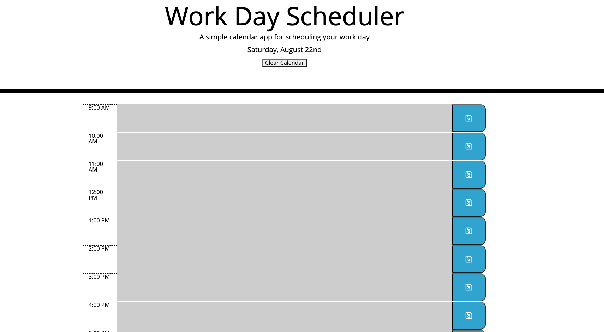

# Ian's Fully Functional Calendar
    OK lets just take a second to get hypeeeeed that this is the first homework that I fully completed. This is a moment for the history books so don't be giving me no b.....

## Description 
    For this homework we built out a website that allows someone to enter in a task the current day and save it. When they press save it will save that text to local storage so that it remains even if the page is refreshed. 

    We also added a feature so that the current time is highlighted in red (I changed to orange cause I don't like red). Past colors are grey, and future colors are green. 

## Screenshot

### Links

My repo - https://github.com/iannater/calendarhomework
My deployed page - https://iannater.github.io/calendarhomework/

